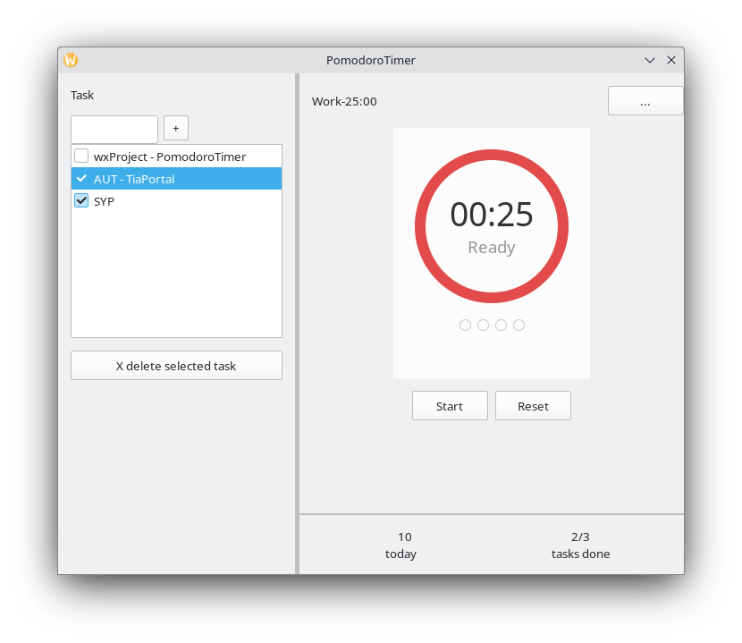
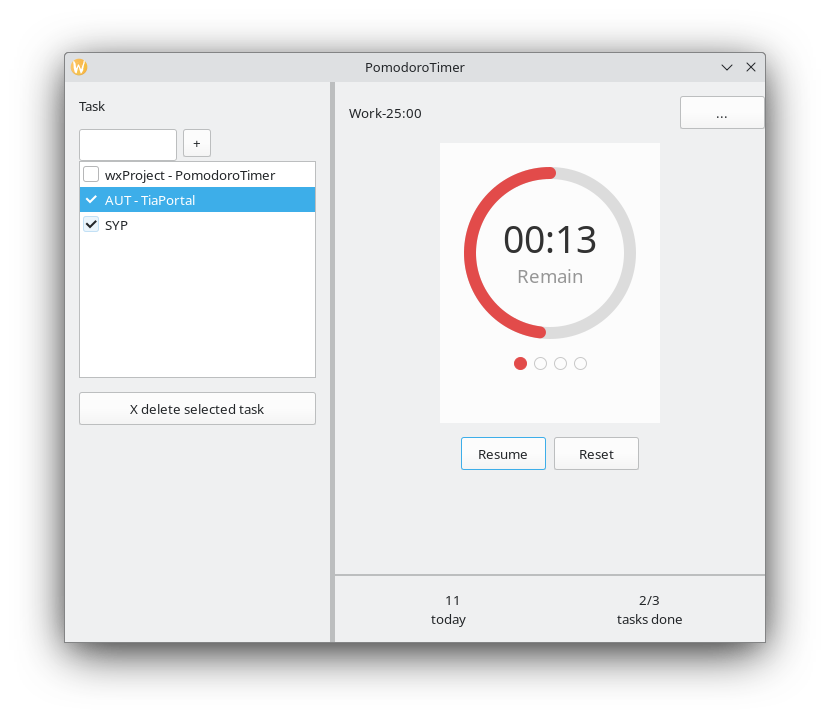
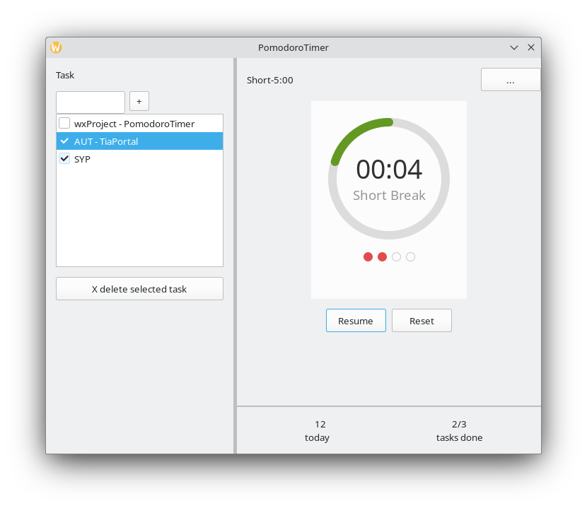
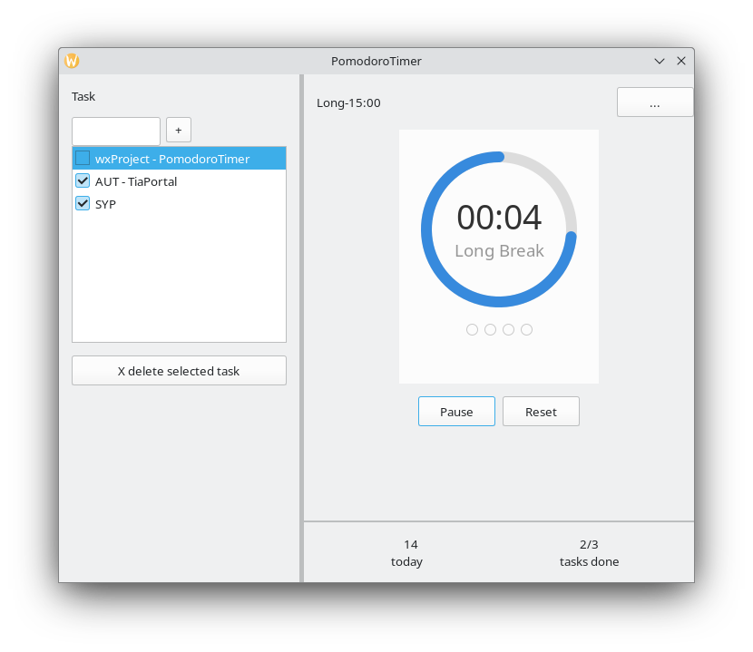
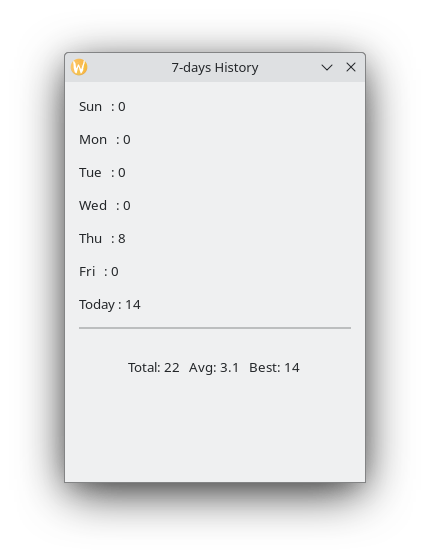
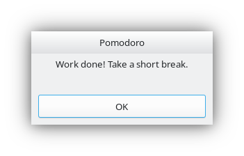

# PomodoroTimer

Ein Desktop-Produktivitäts-Timer, entwickelt mit C++ und wxWidgets, basierend auf der Pomodoro-Technik.



## Über die Pomodoro-Technik

Die Pomodoro-Technik ist eine Zeitmanagement-Methode, die Ende der 1980er Jahre von Francesco Cirillo entwickelt wurde. Der Name stammt vom italienischen Wort für "Tomate" und wurde von der tomatenförmigen Küchenuhr inspiriert, die Cirillo als Student benutzte.

Die Grundidee: Die menschliche Aufmerksamkeit kann sich nicht über lange Zeiträume konzentrieren. Statt stundenlang ohne Pause zu arbeiten, wird die Arbeit in konzentrierte 25-Minuten-Intervalle ("Pomodoros") aufgeteilt, die durch Pausen getrennt sind.

**Funktionsweise:**
1. Eine Aufgabe aus der Liste auswählen.
2. 25 Minuten lang darauf konzentrieren (ein Pomodoro).
3. Eine 5-minütige kurze Pause machen.
4. Nach jeweils 4 Pomodoros eine längere Pause von 15 Minuten machen.
5. Den Zyklus wiederholen.

## Funktionen

- **Aufgabenliste** – Aufgaben hinzufügen, auswählen, löschen und abhaken.
- **Visueller Kreis-Timer** – ein farbiger Ring, der auf einem Canvas gezeichnet wird, zeigt die verbleibende Zeit auf einen Blick.
- **Automatischer Phasenwechsel** – Arbeit, kurze Pause und lange Pause folgen automatisch aufeinander, jeweils in einer eigenen Farbe dargestellt (Arbeit = rot, kurze Pause = grün, lange Pause = blau).
- **Pomodoro-Zähler** – vier Punkte zeigen den Fortschritt innerhalb der aktuellen Runde.
- **Tagesstatistik** – die Anzahl der heute abgeschlossenen Pomodoros und die Anzahl der erledigten Aufgaben sind immer sichtbar.
- **7-Tage-Verlauf** – ein separates Fenster listet die an jedem der letzten 7 Tage abgeschlossenen Pomodoros auf, mit Gesamt-, Durchschnitts- und Bestwert-Statistik.
- **Dauerhafte Speicherung** – abgeschlossene Pomodoros werden auf der Festplatte gespeichert und beim nächsten Start wiederhergestellt.
- **Benachrichtigung am Phasenende** – wenn eine Phase endet, informiert ein Meldungsfenster den Benutzer.

## Screenshots

| Arbeitsphase |
|--------------|
|  |

| Kurze Pause | Lange Pause |
|-------------|-------------|
|  |  |

| Verlauf | Benachrichtigung |
|---------|------------------|
|  |  |

## Build-Anleitung

### Voraussetzungen

- Ein C++17-Compiler (g++ oder clang)
- [wxWidgets](https://www.wxwidgets.org/) 3.2 (Entwicklungsdateien)
- CMake 3.16 oder neuer

Unter Debian/Ubuntu können die Abhängigkeiten installiert werden mit:

```bash
sudo apt install build-essential cmake libwxgtk3.2-dev
```

### Kompilieren

```bash
git clone https://github.com/song2617/pomodoro-timer.git
cd pomodoro-timer
mkdir build
cd build
cmake ..
make -j
```

Dies erzeugt drei ausführbare Dateien im Verzeichnis `build`:

- `PomodoroTimer` – die Hauptanwendung
- `test_task` – Unit-Tests für die Klasse `Task`
- `test_timer` – Unit-Tests für die Klasse `Timer`

### Ausführen

```bash
./PomodoroTimer
```

### Tests ausführen

```bash
./test_task
./test_timer
```

Jedes Testprogramm gibt `All ... tests passed!` aus, wenn alle Zusicherungen erfolgreich sind.

## Benutzerhandbuch

### Aufgaben verwalten

- Einen Aufgabennamen in das Eingabefeld oben links eingeben und die **+**-Schaltfläche drücken, um sie hinzuzufügen.
- Auf eine Aufgabe klicken, um sie auszuwählen.
- **X delete selected task** drücken, um die ausgewählte Aufgabe zu entfernen.
- Das Kontrollkästchen neben einer Aufgabe anhaken, um sie als erledigt zu markieren; der Zähler **tasks done** wird entsprechend aktualisiert.

### Timer verwenden

- **Start** drücken, um eine 25-minütige Arbeitsphase zu beginnen. Der Kreisring verkleinert sich mit der Zeit.
- Während des Laufs zeigt die Schaltfläche **Pause**; durch Drücken wird pausiert. Anschließend zeigt sie **Resume**, um fortzufahren.
- **Reset** drücken, um den aktuellen Pomodoro abzubrechen und zu 25:00 zurückzukehren.
- Wenn eine Phase endet, erscheint eine Benachrichtigung. Die nächste Phase (Pause oder Arbeit) wird automatisch geladen und wartet darauf, dass **Start** gedrückt wird.

### Verlauf anzeigen

- Die **...**-Schaltfläche in der oberen rechten Ecke drücken, um das 7-Tage-Verlaufsfenster zu öffnen.

## Debug-Modus

Zum Testen enthält `src/Timer.cpp` ganz oben ein `#define DEBUG_MODE`. Wenn aktiviert, werden die Dauern auf 10 / 2 / 5 Sekunden verkürzt, damit die Phasenübergänge schnell beobachtet werden können. Diese Zeile auskommentieren für die normalen Dauern von 25 / 5 / 15 Minuten.

## Projektstruktur

pomodoro-timer/

├── CMakeLists.txt

├── LICENSE

├── README.md

├── src/

│   ├── app.cpp / app.hpp            # wxWidgets-Anwendungseinstiegspunkt

│   ├── MainFrame.cpp / .hpp         # Hauptfenster, Layout und Ereignisbehandlung

│   ├── PomodoroCanvas.cpp / .hpp    # selbstgezeichneter Kreis-Timer

│   ├── Timer.cpp / .hpp             # Timer-Logik (nicht-GUI)

│   └── Task.cpp / .hpp              # Aufgaben-Datenmodell (nicht-GUI)

└── tests/

├── test_task.cpp                # Unit-Tests für Task

└── test_timer.cpp               # Unit-Tests für Timer

## Lizenz

Dieses Projekt ist unter der MIT-Lizenz lizenziert – siehe die Datei [LICENSE](LICENSE) für Details.
